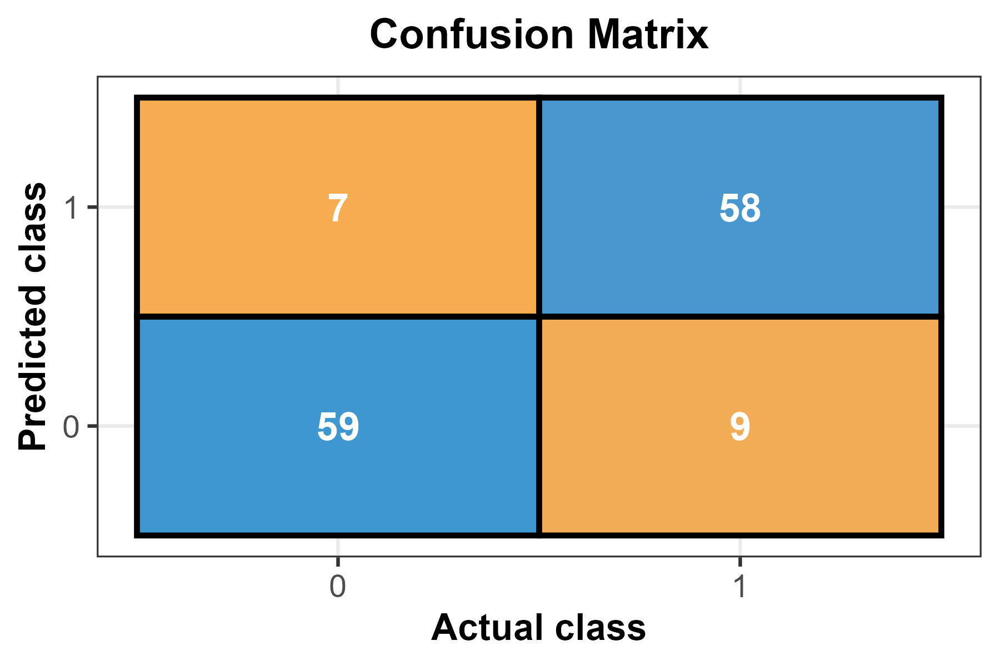
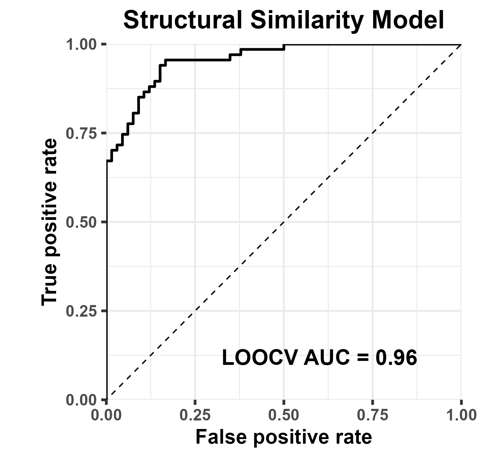
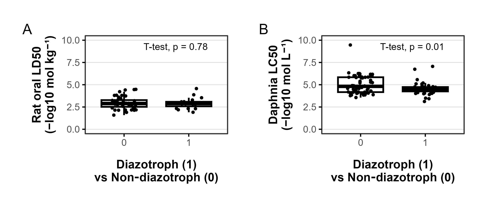

# Secondary Metabolites and Diazotrophs

This repository contains the R Markdown workflow used to predict diazotrophic cyanobacteria using secondary metabolite information. The analysis is available as both the source `.Rmd` file and a knitted HTML report.

## Repository contents

- `diazotrophic_metabolite_analysis.Rmd` – source code for the analysis.
- `diazotrophic_metabolite_analysis.html` – knitted version showing the results and the exact R session information.
- `results/` – generated figures and CSV tables, including:
  - `confusion_matrix.png`
  - `roc_curve_step.png`
  - `toxicity_boxplots.png`
  - `AllUnknownPredictions2.csv`
  - `UnlabeledCompoundResults2.csv`
  - `UnlabeledStrainResults2.csv`
- Several CSV files of toxicity data used by the script.

## Running locally

To reproduce the analysis on your machine, download this repository, open the `diazotrophic_metabolite_analysis.Rmd` file in R (or RStudio/Posit Workbench) and knit it. The required package versions and the R version (4.5.1) are listed at the end of the knitted HTML file. You can install any missing packages directly when knitting:

```r
rmarkdown::render("diazotrophic_metabolite_analysis.Rmd")
```

## Run online via Posit Cloud

If you prefer not to install anything locally, the entire project can be executed in Posit Cloud. After signing in with a free Posit account, open the following workspace and run the R Markdown file there:

<https://posit.cloud/content/10552080>

## Example results

Below are the key figures produced by the notebook.







## License

All content is provided for educational and research purposes.
